I hvilke kommuner hev partierne deres stemmer hjem
================
Mikkel Freltoft Krogsholm
2022-11-04

## Data

Jeg indlæser først data og beregner det jeg vil på kommunalt-niveau.

Derefter indlæser jeg kortdata fra DAWA

``` r
source("../style/colors.R")

valgsteder <- read_csv("../data/valgsteder.csv")

range01 <- function(x){(x-min(x, na.rm = T))/(max(x, na.rm = T)-min(x, na.rm = T))}

mundata <- valgsteder %>%
  select(letter, votes, kommunekode) %>%
  group_by(kommunekode, letter) %>%
  summarise(votes = sum(votes)) %>%
  group_by(kommunekode) %>%
  mutate(percentage = (votes / sum(votes)) * 100) %>%
  group_by(letter) %>%
  mutate(x01 = percentage %>% range01) %>%
  ungroup()

mundata_w <- mundata %>%
  select(-votes, -percentage) %>%
  pivot_wider(names_from = letter, values_from = x01) %>%
  rename(kode = kommunekode)

kommune_url <- "https://api.dataforsyningen.dk/kommuner?format=geojson"
file <- read_file(kommune_url)
sf <- geojson_sf(file)

sf_simple <- st_simplify(sf, preserveTopology = TRUE, dTolerance = 50)

pd <- sf_simple %>% left_join(mundata_w, by = "kode")
```

## Kortælgning

Nu kan jeg så kortlægge, hvor I Danmark partierne hentede deres stemmer
fra.

``` r
letters <- c("A","B","C","D","F","I","K","M","O","Q","V","Æ","Ø","Å" )

for(l in letters){
  pd2 <- pd %>% rename(PV = l)

p <- ggplot(pd2) +
  geom_sf(aes(fill = PV), color = "black", size = .1, show.legend = FALSE) +
  scale_fill_gradient(low = "#FFFFFF", high = party_colors[l]) +
  theme_map() +
  labs(title = glue::glue("Stemmefordeling for {l}"))

print(p)
}
```

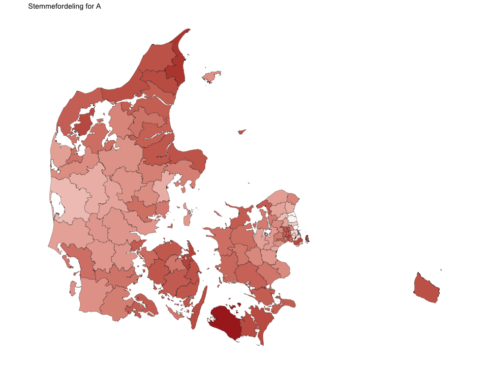<!-- -->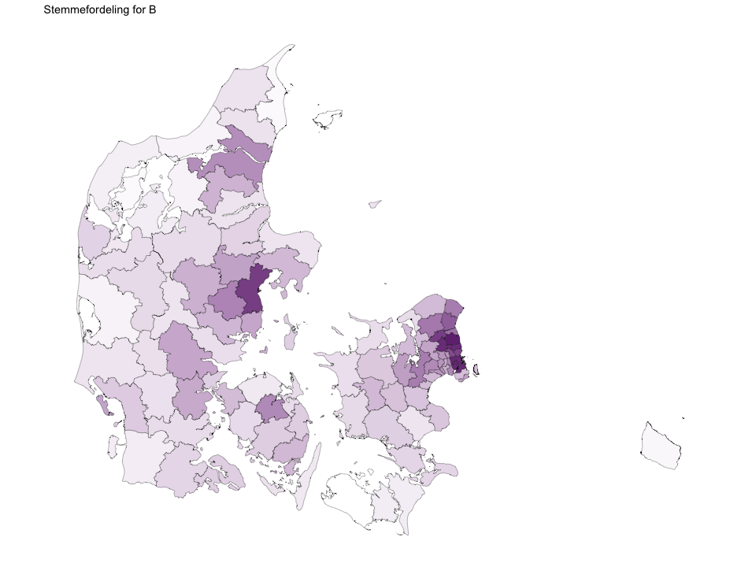<!-- -->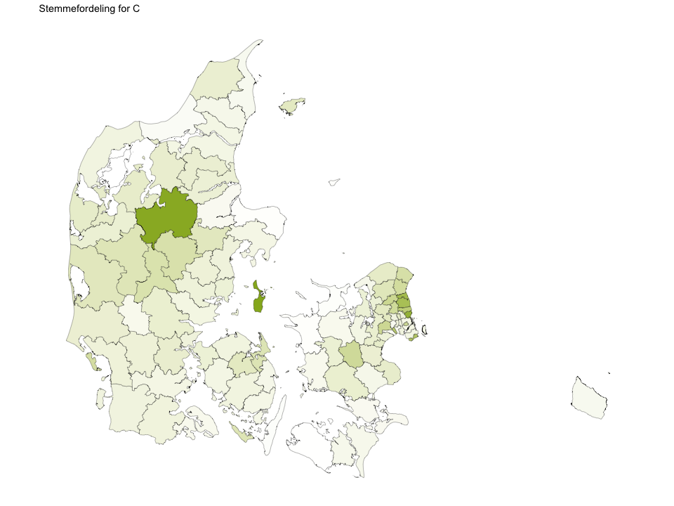<!-- -->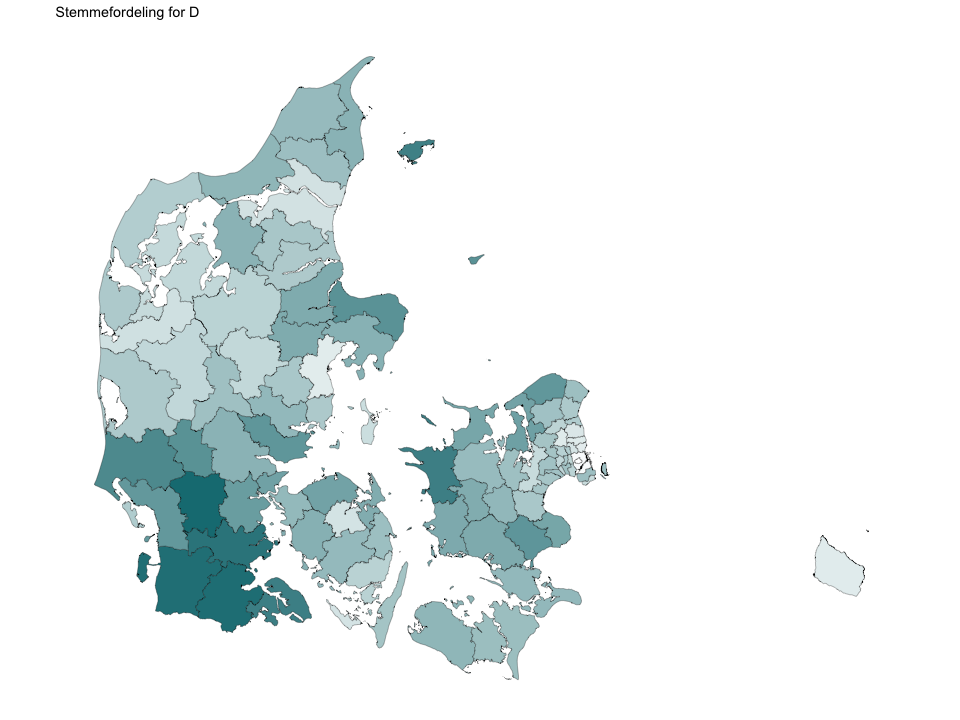<!-- -->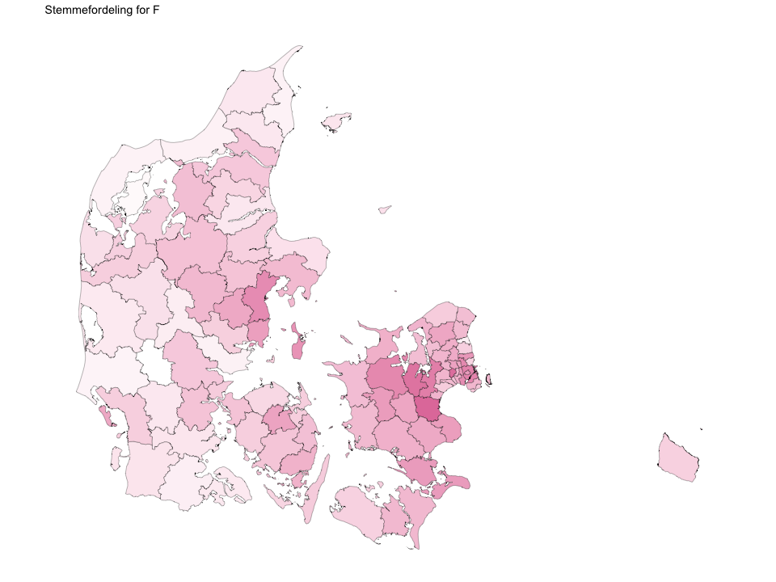<!-- -->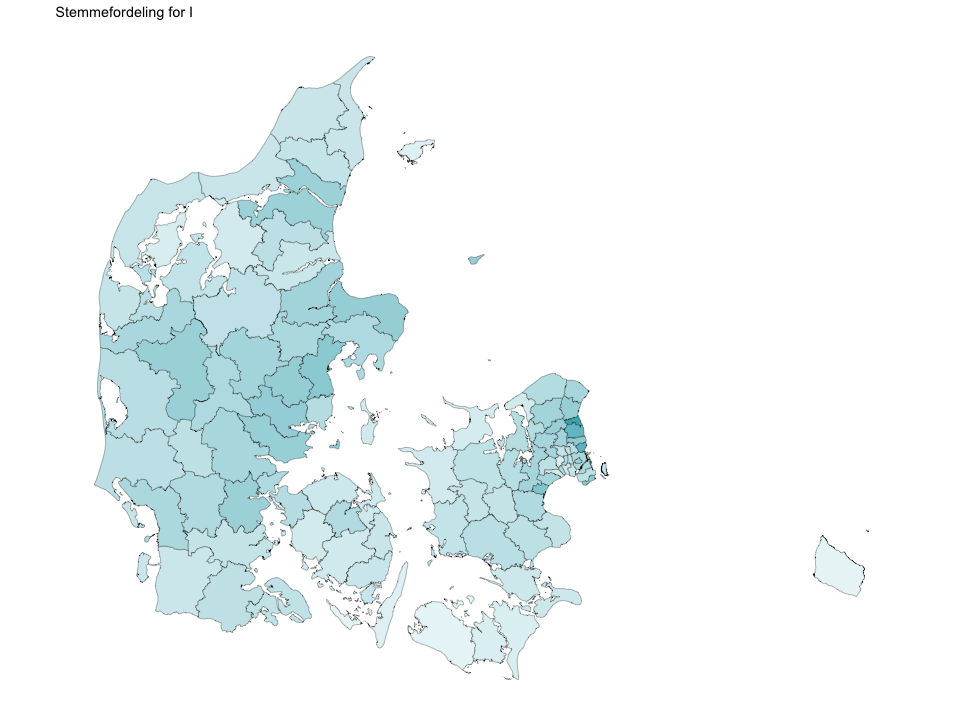<!-- -->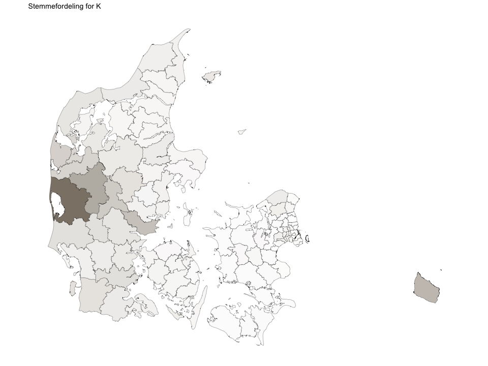<!-- -->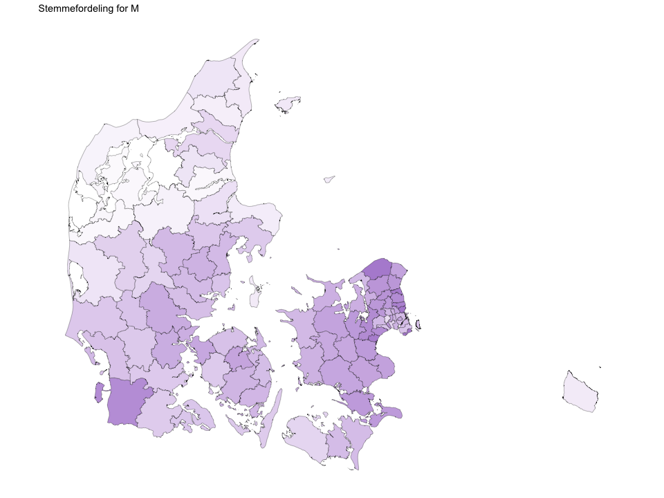<!-- -->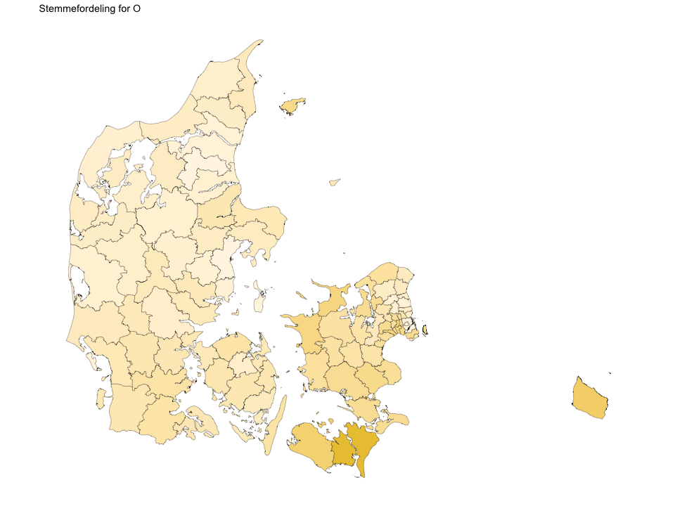<!-- -->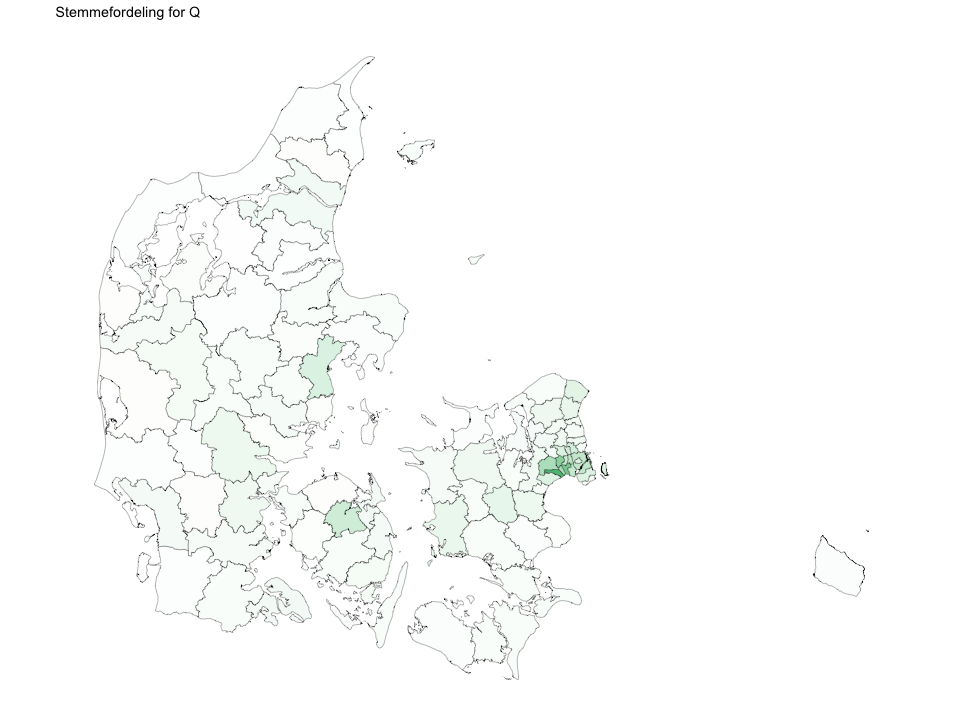<!-- -->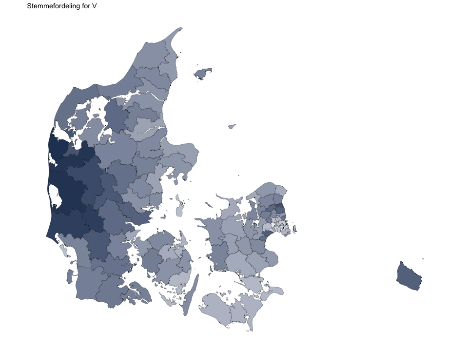<!-- -->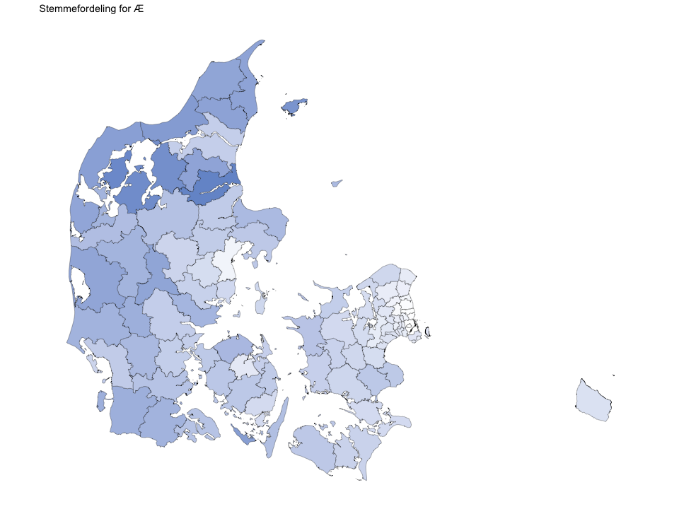<!-- -->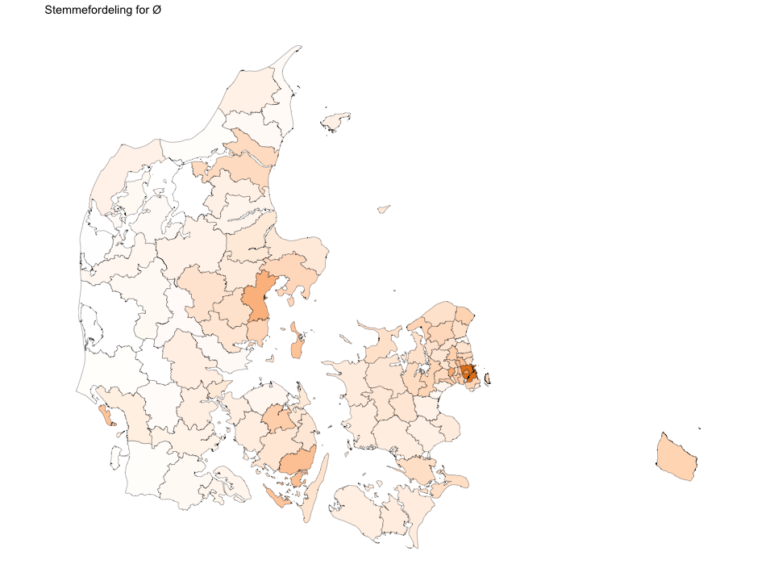<!-- -->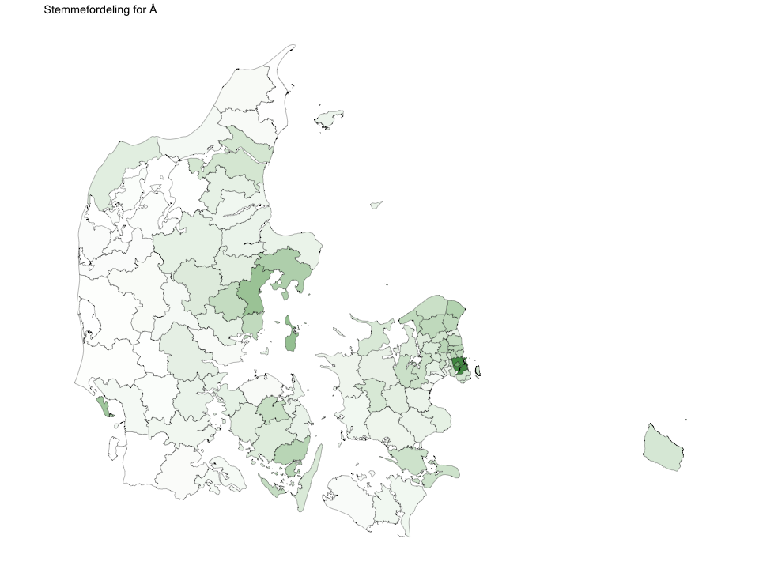<!-- -->
