Partiernes Udvilking frem mod Valget
================
Mikkel Freltoft Krogsholm
2022-11-03

## Data

Læs data ind og gør det klar til at plotte.

``` r
source("../style/colors.R")

polls <- read_csv("../data/polls.csv")
valgsteder <- read_csv("../data/valgsteder.csv")

result <- valgsteder %>%
  group_by(letter) %>%
  summarise(votes = sum(votes, na.rm = T)) %>%
  mutate(percentage = votes/sum(votes) * 100) %>%
  filter(!str_detect(letter, "^UP")) %>%
  mutate(date = as.Date("2022-11-01"))
  
polls_current <- polls %>%
  filter(date >= "2022-01-01") %>%
  select(date, letter, percentage)
```

## Plots

Derefter laver vi et plot for hvert parti

``` r
plot_party <- function(l){
  polls_current_l <- polls_current %>% filter(letter == l)
  result_l <- result %>% filter(letter == l)
  
  ggplot() +
    geom_point(data = polls_current_l, aes(date, percentage, color = letter), alpha = .3) +
    geom_smooth(data = polls_current_l, aes(date, percentage, color = letter), se = FALSE) +
    geom_point(data = result_l, aes(date, percentage, color = letter), size = 8, alpha = .75) +
    geom_point(data = result_l, aes(date, percentage, color = letter), size = 8, shape = 1) +
    geom_text(data = result_l, aes(date, percentage, label = letter), color = "white") +
    labs(x = "", y = "Procenter") +
    scale_color_manual(values = party_colors) +
    scale_fill_manual(values = party_colors) +
    theme_minimal() + 
    theme(legend.position = "none") 
}

for(l in result$letter){
  p <- plot_party(l)
  print(p)
}
```

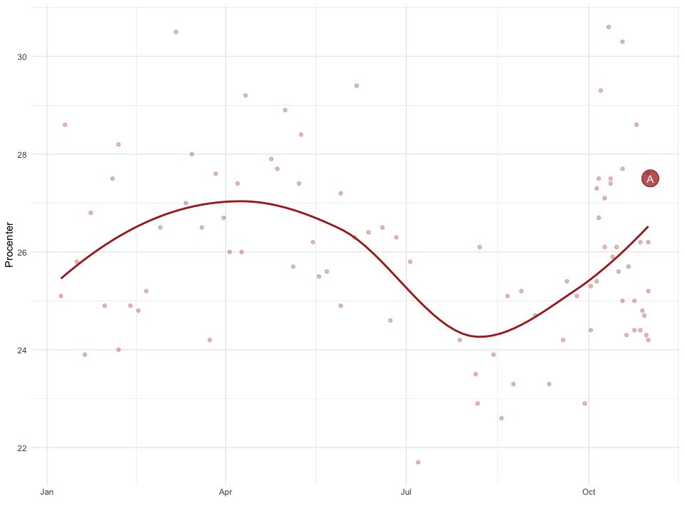<!-- -->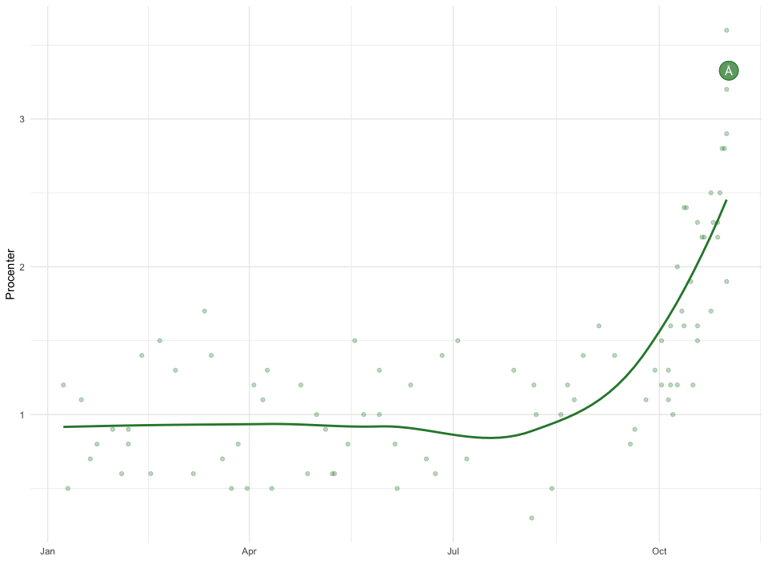<!-- -->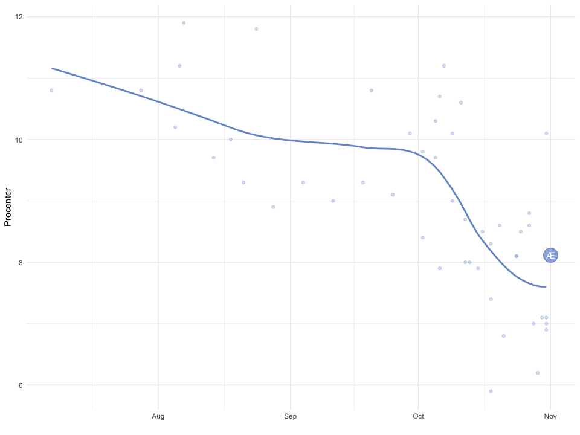<!-- -->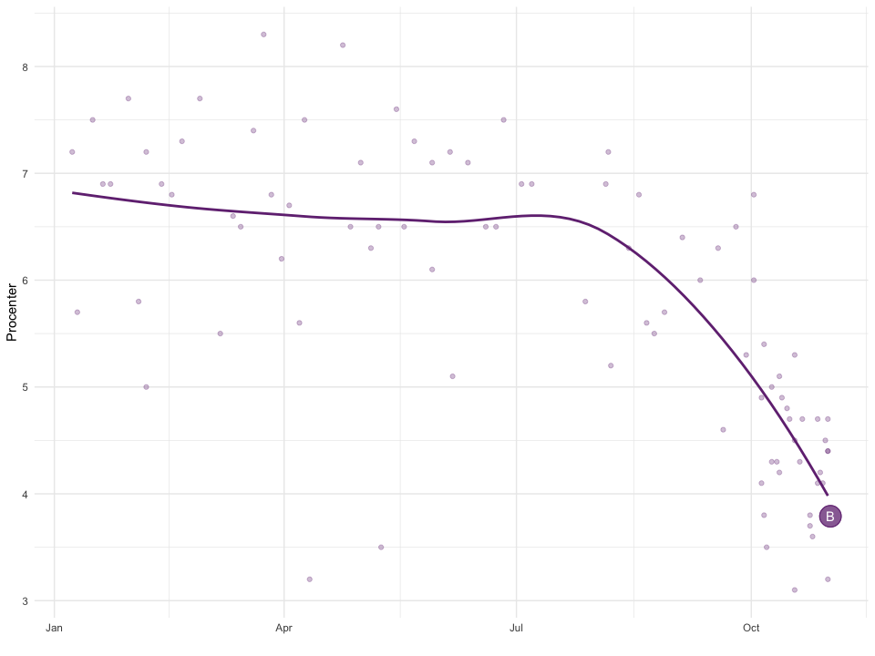<!-- -->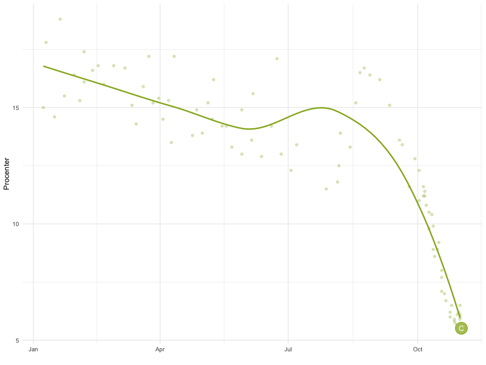<!-- -->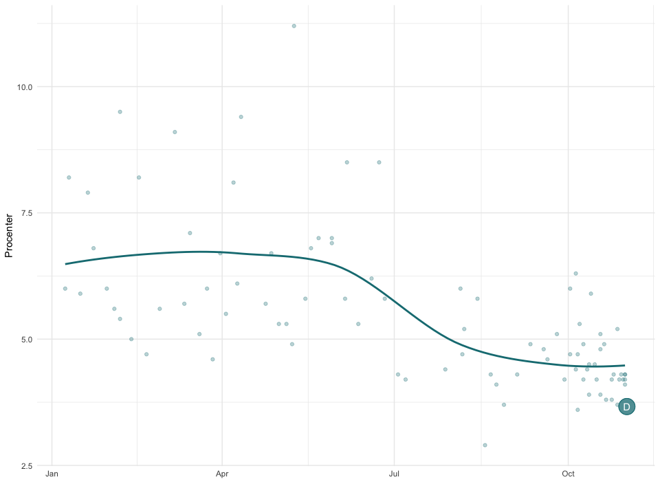<!-- -->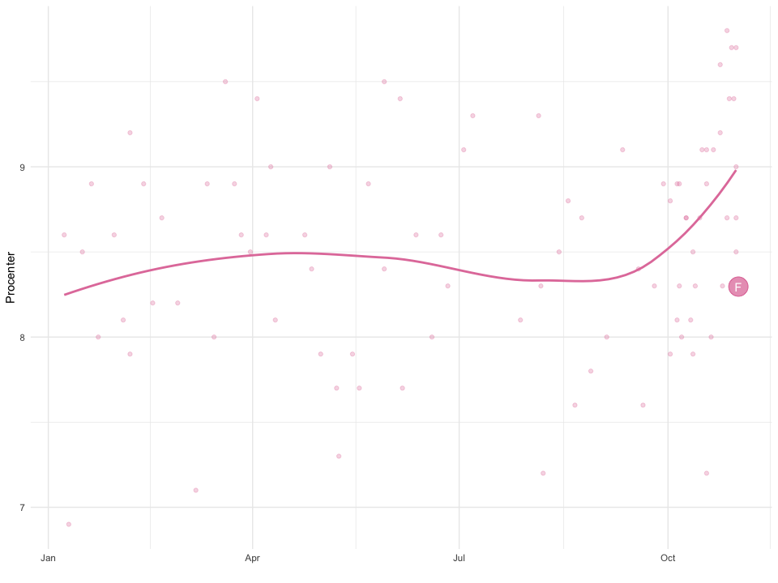<!-- -->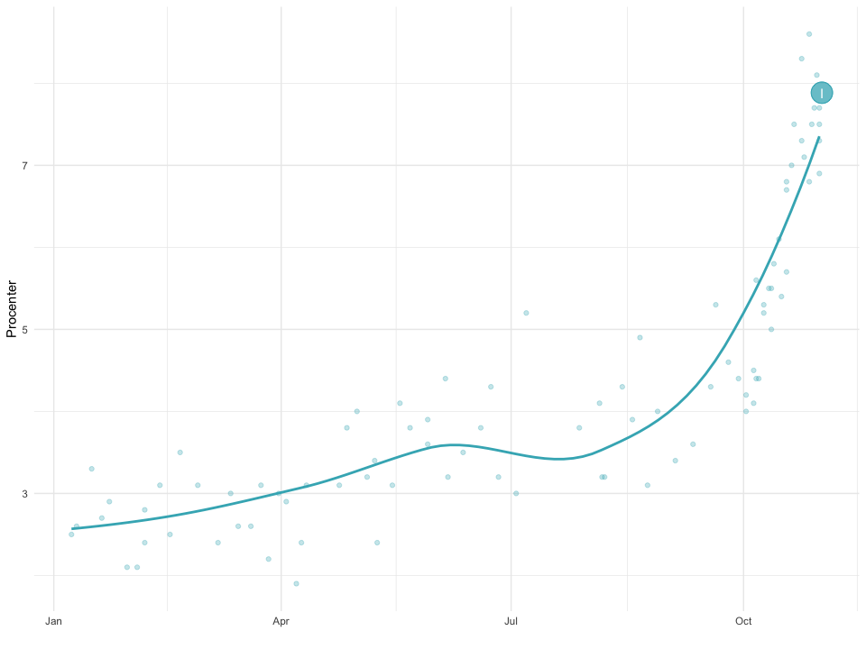<!-- -->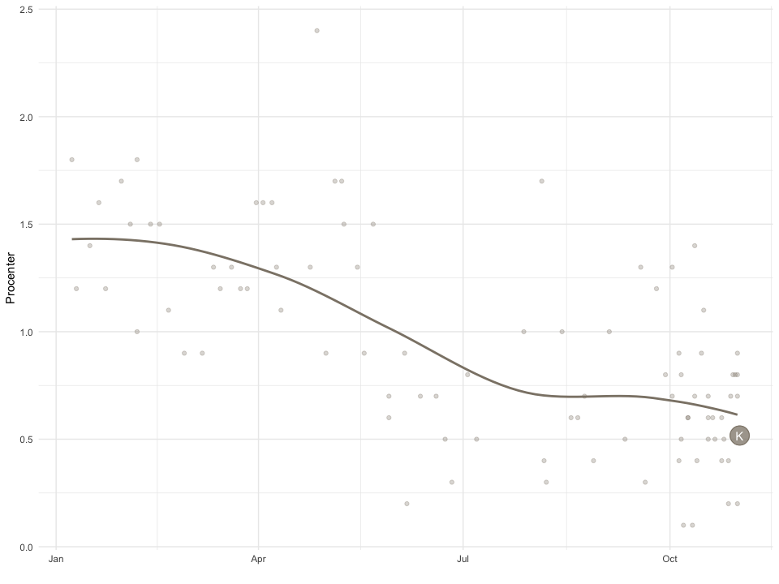<!-- -->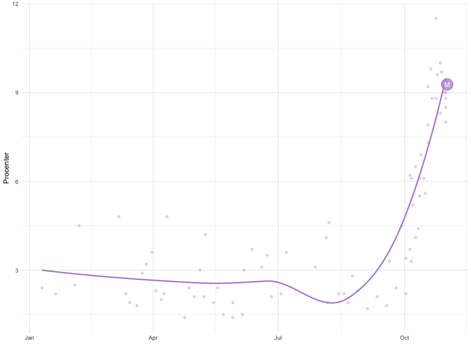<!-- -->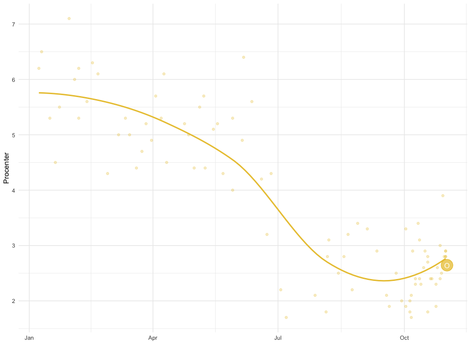<!-- -->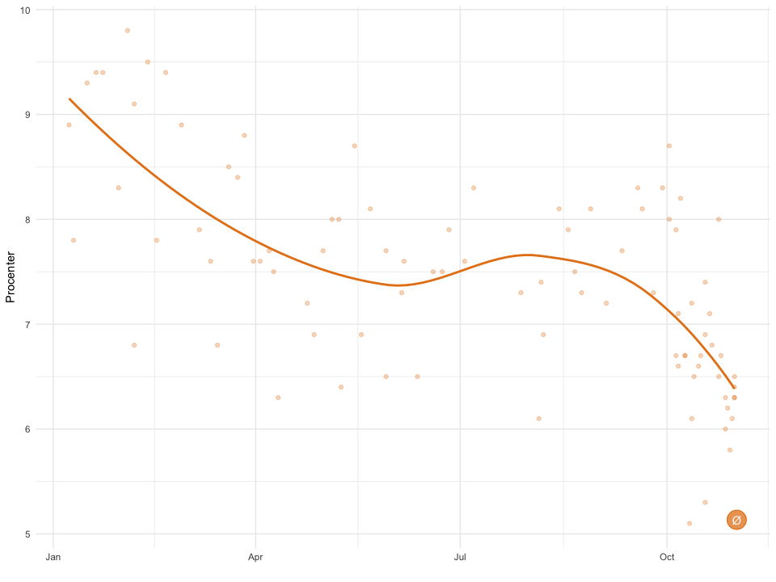<!-- -->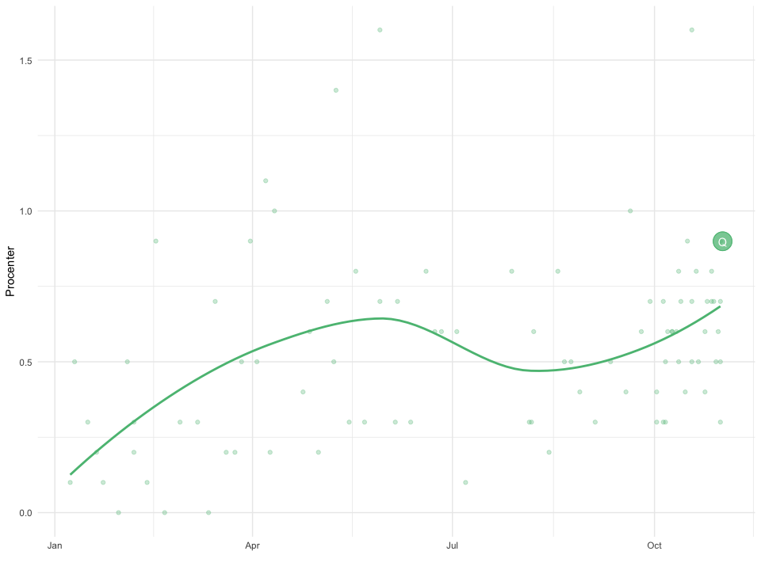<!-- -->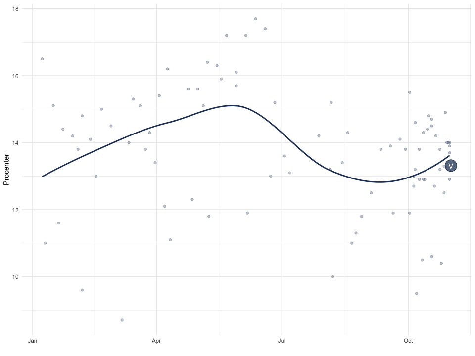<!-- -->
